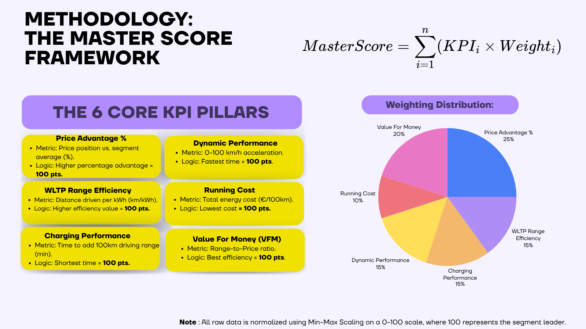

# EV-Market-Intelligence-Study-2026

A strategic data-driven benchmarking study of the 2026 EV market landscape. Utilizing a proprietary Master Score framework to analyze technical performance vs. real-world practicality across B and C segments.

## 📊 Methodology: The Master Score Framework
Our proprietary data-driven framework uses a mathematical model of six key performance indicators, weighted for customer and strategic value, to deliver objective benchmarking.

### The 6 Core KPI Pillars & Weighting:
* **Price Advantage (25%):** Price position vs. segment average.
* **Value For Money (20%):** Range-to-Price ratio.
* **WLTP Range Efficiency (15%):** Distance driven per kWh (km/kWh).
* **Dynamic Performance (15%):** 0-100 km/h acceleration.
* **Charging Performance (15%):** Time to add 100km driving range.
* **Running Cost (10%):** Total energy cost per 100km.

> **Note:** All raw data is normalized using Min-Max Scaling on a 0-100 scale, where 100 represents the segment leader.

## ⚔️ Key Battles & Strategic Highlights

### Battle 1: Small EV Segment (Renault 5 vs. Opel Corsa Electric)
* **Master Score:** Renault 5 achieved **81.2%**, which is ~4% higher than the segment average.
* **Strategic Verdict:** While Corsa Electric wins as the absolute 'Value for Money' driver, Renault 5 presents a superior urban package with **V2L tech** and **10.3m** turning circle.

### Battle 2: Compact Efficiency (Renault Megane vs. Tesla Model 3 RWD)
* **Technical Lead:** Tesla dominates highway efficiency and charging infrastructure synergy.
* **Practical Edge:** Renault counters with urban agility (**10.4m** turning circle vs Tesla's 11.7m) and future-proof **V2L versatility**.

### Battle 3: High-Value SUV Mastery (Renault Scenic vs. Tesla Model Y RWD)
* **Family Choice:** Renault Scenic emerges as the superior family vehicle, winning on critical real-world criteria including **545L boot space** and better urban maneuverability.
* **Efficiency Lead:** Tesla Model Y remains the technical victor for long-distance cruising.

### Battle 4: Entry-Level Dominance (Renault Twingo vs. Hyundai INSTER)
* **Rational Choice:** Twingo E-Tech secured a decisive victory with an **83.6% Master Score**, outperforming the segment average in every key metric.
* **Operational Leadership:** Twingo sets the benchmark with a **3.93 €** running cost and a standard heat pump.

 The raw data, normalization calculations, and the Master Score mathematical model are available in the accompanying Excel file in this repository.

## 🏁 Final Verdict
The data reveals a clear functional split: While global competitors lead in raw highway efficiency or charging speed, the Renault E-Tech ecosystem masters 'Everyday Reality'. By balancing technical benchmarks with superior urban agility and modern utility (V2L), these models define the most rational and future-proof choice for 2026 EV users.
---

**Prepared by:** Mehmet Yılmaz
**Role:** Computer Engineering Student | Aspiring Data & Strategy Analyst
**LinkedIn:** [https://www.linkedin.com/in/mehmetilz/](https://www.linkedin.com/in/mehmetilz/)
**Contact:** mehmetyilmaz.cse@gmail.com
